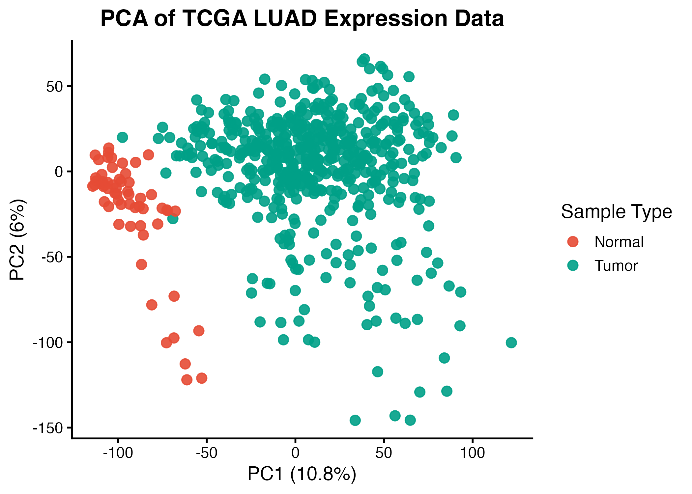
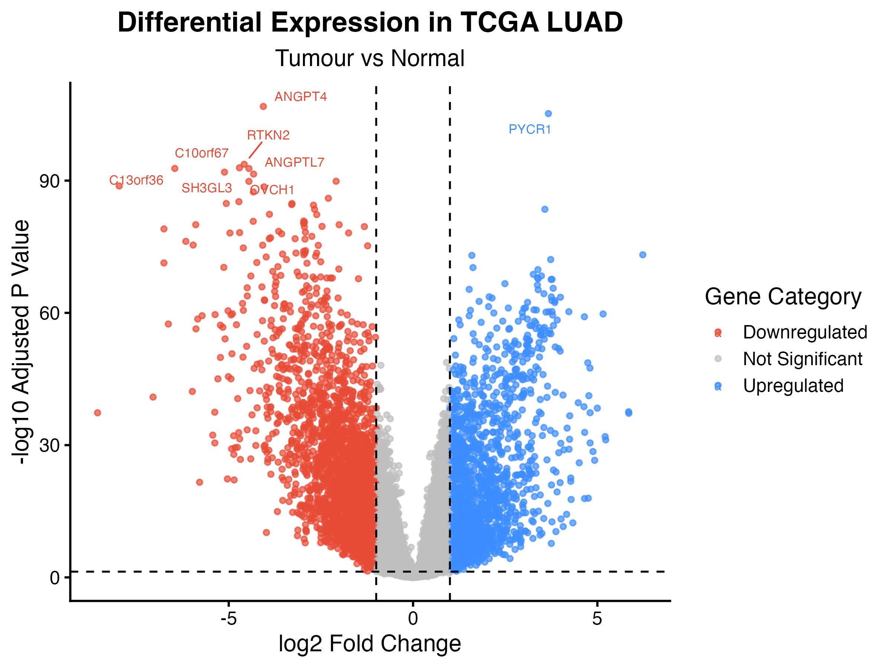
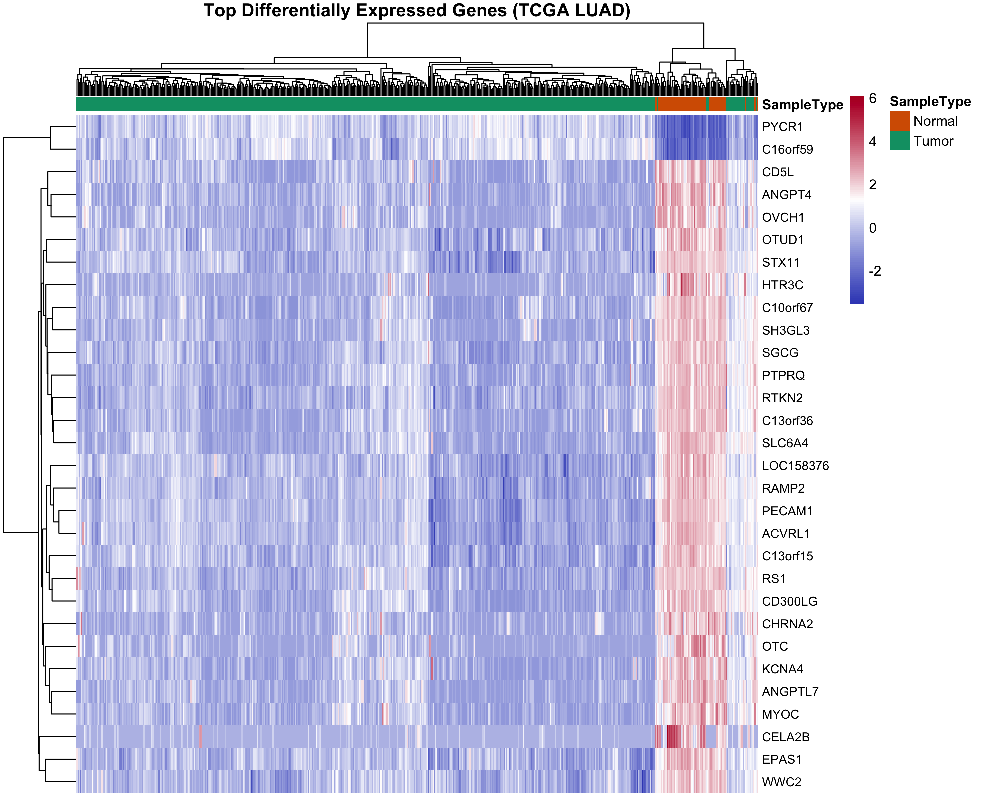
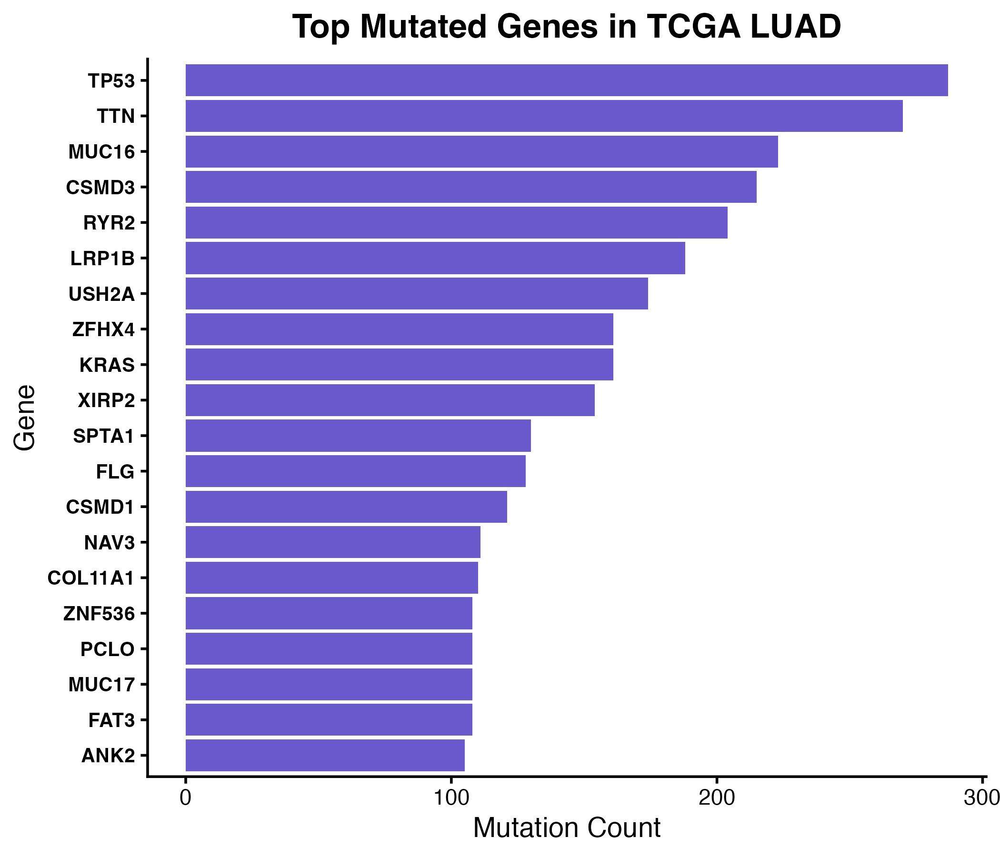
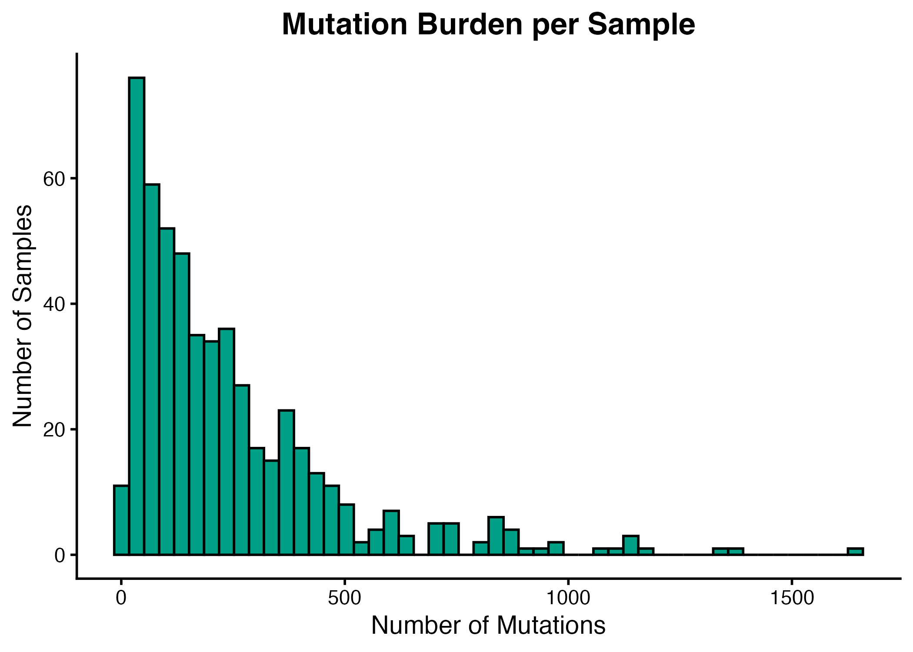
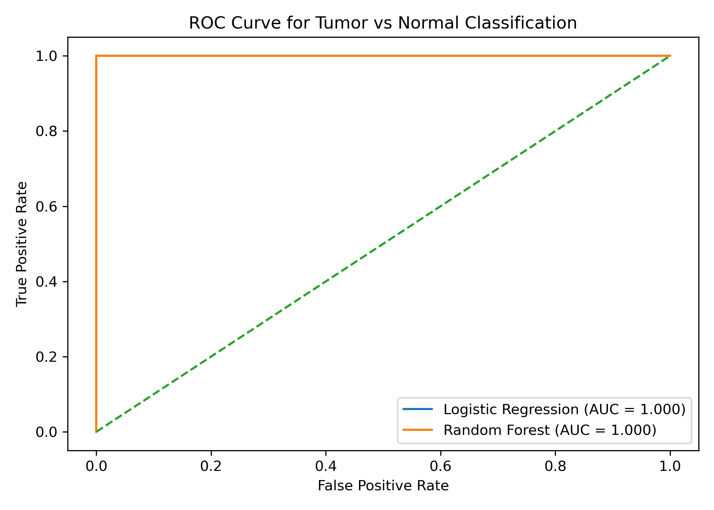
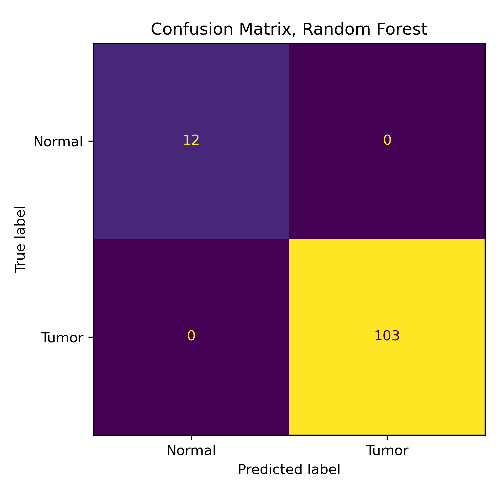
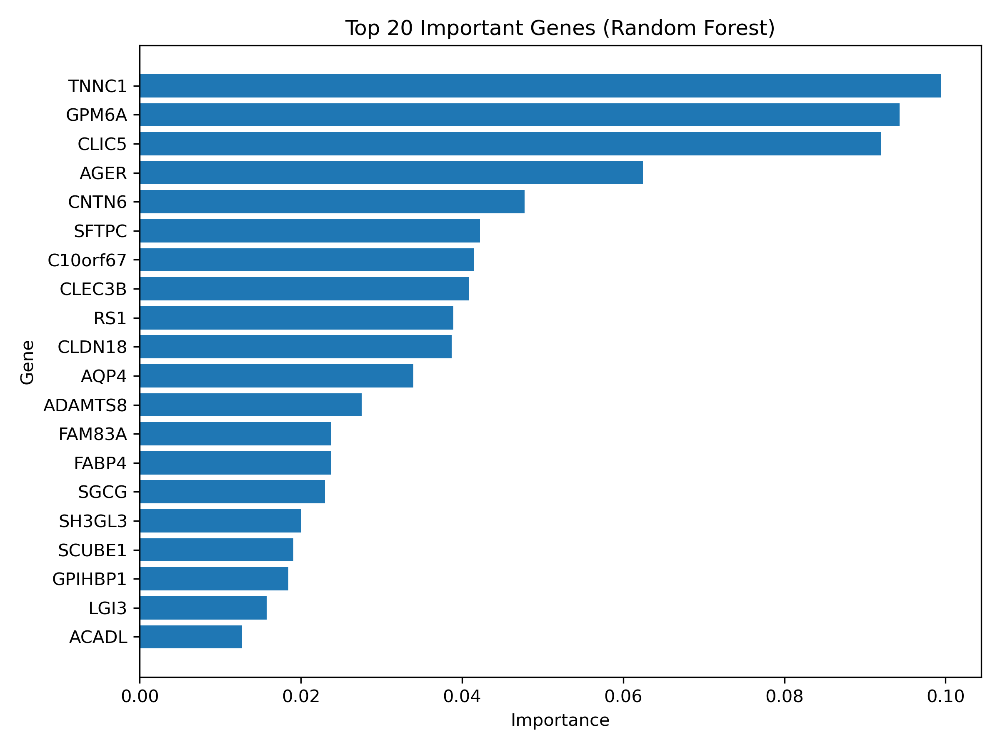

# 🧬 End-to-End Multi-Omics Cancer Genomics Pipeline  
### TCGA Lung Adenocarcinoma (LUAD)

---

## 📌 Project Summary

This repository implements a reproducible and modular, end-to-end computational pipeline for integrative analysis of TCGA Lung Adenocarcinoma (LUAD) data. The workflow spans transcriptomic profiling, somatic mutation analysis, and supervised machine learning to characterise tumour-specific molecular signatures and build predictive models of cancer state.

The project is designed to reflect real-world bioinformatics and AI-driven biomedical pipelines, combining statistical genomics, scalable data preprocessing, and predictive modelling.

---

## 🎯 Objectives

- Quantify transcriptomic differences between tumour and normal lung tissue  
- Identify significantly dysregulated genes using robust statistical methods  
- Characterise mutation landscapes and tumour heterogeneity  
- Train and evaluate machine learning models for tumour classification  
- Demonstrate a production-style, modular bioinformatics workflow  

---

## 📂 Repository Structure

The pipeline follows a modular design, enabling reproducibility and easy extension to additional omics layers.

```
genomics-cancer-pipeline/
├── data/
│ ├── raw/        # Raw TCGA data
│ ├── processed/  # Cleaned, analysis-ready datasets
│ └── mutation/   # Mutation matrices (LUAD)
├── scripts/
│ ├── 01_prepare_metadata.R         # Clean and standardise sample metadata
│ ├── 02_prepare_counts.R           # Preprocess expression matrix
│ ├── 03_differential_expression.R  # Identify differentially expressed genes (limma)
│ ├── 04_mutation_analysis.R        # Analyse mutation frequencies and burden
│ ├── 05_ml_classifier.py           # Train classification models
│ └── 06_visualisations.R           # Generate PCA, volcano, heatmap
├── results/
│ ├── figures/  # Plots and visual outputs
│ └── tables/   # Statistical outputs
├── env/
│ ├── environment.yml
│ └── requirements.txt
└── README.md
```

---

## ⚙️ Setup

```bash
git clone https://github.com/your-username/genomics-cancer-pipeline.git
cd genomics-cancer-pipeline

pip install -r env/requirements.txt
```

---


## 📦 Data Availability

Due to size constraints, raw datasets are not included in this repository.

Data sources:
- TCGA LUAD RNA-seq data (UCSC Xena)
- TCGA clinical metadata
- Mutation data (LinkedOmics)

Processed datasets can be regenerated using the provided scripts.

---


## 🧬 Data Sources

- TCGA LUAD RNA-seq expression data (UCSC Xena, STAR counts)
- TCGA clinical metadata (sample annotations)
- Somatic mutation data (LinkedOmics, gene-level mutation matrix)

---

## ⚙️ Methodology

### 1. Data Harmonisation and Preprocessing

- Standardised TCGA barcodes across datasets (expression, metadata, mutation)
- Removed technical artefacts (e.g. prefix handling, truncation to 15-character IDs)
- Matched samples across modalities (574 shared samples)
- Removed zero-variance genes prior to dimensionality reduction
- Ensured strict alignment between expression matrix and metadata labels

This step is critical to prevent label misassignment and ensure downstream statistical validity.

---

### 2. Exploratory Transcriptomic Analysis (PCA)

Principal Component Analysis (PCA) was applied to scaled gene expression data (~20,000 genes) to:

- Identify dominant axes of variation
- Assess sample clustering structure
- Validate preprocessing quality

Tumour and normal samples exhibit clear separation along principal components, indicating strong transcriptomic divergence.

---

### 3. Differential Expression Analysis

Differential expression was performed using the **limma** framework:

- Linear modelling across ~20,530 genes  
- Empirical Bayes moderation of variance  
- Multiple testing correction (Benjamini–Hochberg)

**Thresholds:**
- Adjusted p-value < 0.05  
- |log2 Fold Change| > 1  

**Results:**
- ~4,400 significantly dysregulated genes  
- Extensive transcriptional reprogramming in tumour samples  

---

### 4. Mutation Analysis

Somatic mutation data was analysed at the gene level:

- Aggregated mutation counts per gene  
- Computed mutation burden per sample  
- Identified frequently mutated genes  

**Key genes identified:**
- TP53  
- KRAS  
- TTN  
- MUC16  

Mutation distributions demonstrate substantial inter-sample heterogeneity, consistent with known LUAD biology.

---

### 5. Machine Learning Classification

Supervised classification was performed using gene expression features:

#### Feature Selection
- Top 100 genes selected using training data only (prevents data leakage)

#### Models
- Logistic Regression (baseline linear model)
- Random Forest (non-linear ensemble model)

#### Validation Strategy
- Stratified train-test split  
- 5-fold cross-validation  
- Metrics: Accuracy, ROC-AUC, Precision, Recall  

---

## 📊 Results

### 🧠 PCA Analysis


Tumour and normal samples separate distinctly, indicating strong global expression differences.

---

### 🔬 Differential Expression


Thousands of genes exhibit significant dysregulation, reflecting widespread transcriptional changes in cancer.

---

### 🧬 Heatmap (Top 50 Genes)


Selected genes clearly stratify tumour and normal samples, validating DE results.

---

### 🧬 Mutation Landscape

#### Top Mutated Genes


#### Mutation Burden Distribution


---

### 🤖 Machine Learning Performance

#### ROC Curve


#### Confusion Matrix


#### Feature Importance


---

## 📈 Model Performance

| Model | Test Accuracy | ROC-AUC | CV Accuracy |
|------|-------------|--------|------------|
| Logistic Regression | 1.00 | 1.00 | 0.996 ± 0.005 |
| Random Forest | 1.00 | 1.00 | 0.989 ± 0.012 |

High performance reflects strong separability between tumour and normal transcriptomes.

---

## 🔍 Biological Insights

- Tumour samples exhibit large-scale transcriptional reprogramming  
- Lung-specific genes (e.g. SFTPC, AGER) are downregulated in tumour tissue  
- Oncogenic mutations (e.g. TP53, KRAS) correlate with altered expression landscapes  
- Gene expression profiles alone are sufficient for accurate tumour classification  

---

## ⚠️ Limitations

- Binary classification (tumour vs normal) is a relatively low-complexity task  
- Class imbalance (tumour-dominant dataset)  
- No external validation dataset  
- Mutation and expression data are analysed independently  

---

## 🚀 Future Directions

- Multi-class classification (tumour subtypes)  
- Integration of mutation + expression features  
- Deep learning models for representation learning  
- Pathway and network-level analysis  
- Extension to single-cell transcriptomics  

---

## 🛠️ Technologies

### Languages
- R
- Python

### Libraries
- limma
- tidyverse
- ggplot2
- pheatmap
- scikit-learn
- pandas
- matplotlib

---

## 🧠 Key Takeaways

- Transcriptomic profiles robustly distinguish tumour from normal tissue  
- Differential expression captures the molecular basis of cancer  
- Machine learning models can exploit these signals for accurate classification  
- Data preprocessing and alignment are critical for valid bioinformatics analysis  
- This project demonstrates the integration of statistical genomics, scalable data processing, and machine learning for translational cancer research applications.

---

## 👤 Author

**Hasini De Silva**  
